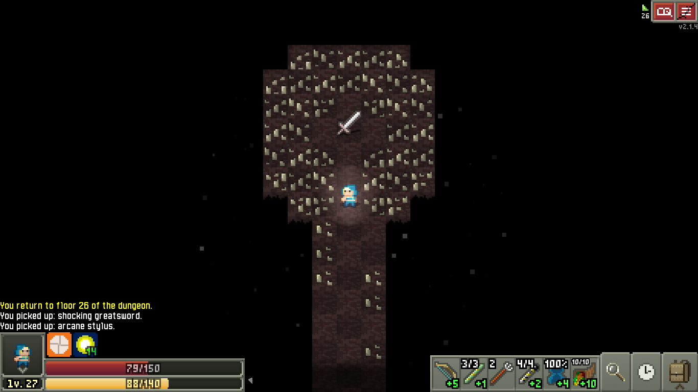

# Intro

## 09

```c:line-numbers
#include <stdio.h>

int main() {
    double d; int b;
    d = 3.14; b = 1;
    printf("Double value: %f\n", d);
    printf("Boolean value: %d\n", b);
}
```

## 10
```c:line-numbers
#include <stdio.h>

int main() {
    long int ld;
    long long int ldd;
    long double Ld;
    short hd;
    ld = 2147484;
    ldd = 922337;
    Ld = 1.1E+4932;
    hd = 32767;
    printf("long int      : %ld\n", ld);
    printf("long long int : %lld\n", lld);
    printf("long double   : %Ld\n", Ld);
    printf("short         : %hd\n", hd);
}
```

## 11
```c:line-numbers
#include <stdio.h>

int main() {
    unsigned int u;
    unsigned long int lu;
    unsigned long long int llu;
    unsigned short hu;
    u = 42;
    lu = 42943;
    llu = 1844674;
    hu = 0;
    printf("unsigned int           : %u\n", u);
    printf("unsigned long int      : %lu\n", lu);
    printf("unsigned long long int : %llu\n", llu);
    printf("unsigned short         : %hu\n", hu);
}
```

## 12
```c:line-numbers
#include <stdio.h>

int main() {
    const float pi = 3.14195;
    printf("Value of pi: %f\n", pi);
}
```

## 13
```c:line-numbers
#include <stdio.h>

#define PI 3.14195

int main() {
    printf("Value of pi: %f\n", PI);
}
```

## 14
```c:line-numbers
#include <stdio.h>

int a = 10;

int main() {
    printf("Global: %d\n", a);
    int a = 20;
    printf("Local: %d\n", a);

    {
        extern int a;
        printf("Global: %d\n", a);
    }
}
```

## 15
```c:line-numbers
#include <stdio.h>

int main() {
    float n; scanf("%f", &n);
    printf("%f   \n", n);
    printf("%10f \n", n);
    printf("%2f  \n", n);
    printf("%.2f \n", n);
    printf("%.0f \n", n);
    printf("%e   \n", n);
}
```

